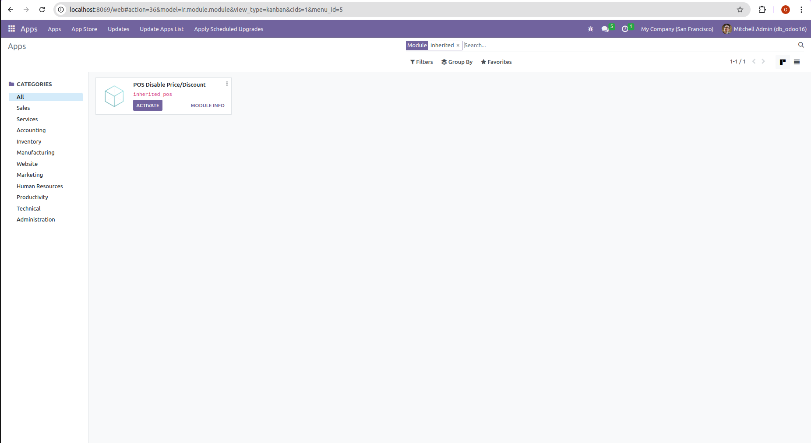

<!-- ABOUT THE PROJECT -->
## Summary

This project is inheritance POS module odoo 16:
- Create a custom odoo module for POS.

### Built With

This project was created using:

* [![Python][Python]][Python-url]
* [![Odoo][Odoo]][Odoo-url]
* [![PostgreSQL][PostgreSQL]][PostgreSQL-url]

<!-- GETTING STARTED -->
## Getting Started

### Prerequisites

Before running this project, make sure you have installed some of the tools below, because I use the Linux operating system, I will give an example using Linux.
* Python 3
  ```sh
  sudo apt install python3
  ```

### Installation

1. Clone the repo
   ```sh
   https://github.com/Galuh80/inheritance_pos.git
   ```
2. Activate your env
   ```sh
   source env/bin/activate
   ```
3. Install requirements
   ```sh
   pip install -r requirements.txt
   ```

<!-- USAGE EXAMPLES -->
## Usage
   
1. Install module
   

<!-- MARKDOWN LINKS & IMAGES -->
<!-- https://www.markdownguide.org/basic-syntax/#reference-style-links -->
[Python]: https://img.shields.io/badge/python-3670A0?style=for-the-badge&logo=python&logoColor=ffdd54
[Python-url]: https://www.python.org/
[Odoo]: https://img.shields.io/badge/python-3670A0?style=for-the-badge&logo=python&logoColor=ffdd54
[Odoo-url]: https://www.odoo.com/id_ID
[PostgreSQL]: https://img.shields.io/badge/postgresql-4169e1?style=for-the-badge&logo=postgresql&logoColor=white
[PostgreSQL-url]: https://www.postgresql.org/
